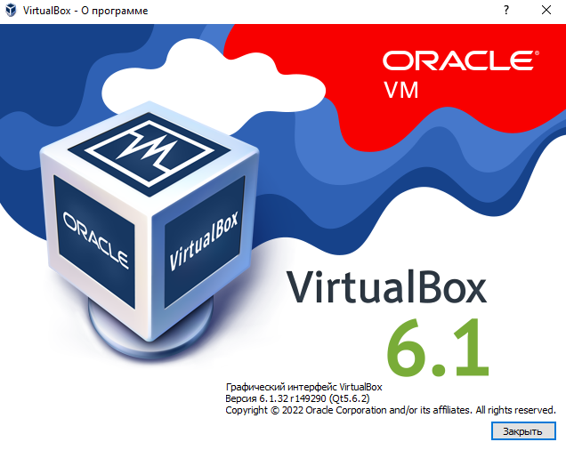
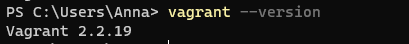
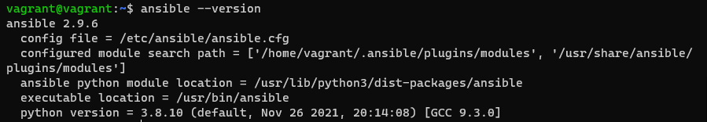

# Домашнее задание к занятию "5.2. Применение принципов IaaC в работе с виртуальными машинами"

## Как сдавать задания

Обязательными к выполнению являются задачи без указания звездочки. Их выполнение необходимо для получения зачета и диплома о профессиональной переподготовке.

Задачи со звездочкой (*) являются дополнительными задачами и/или задачами повышенной сложности. Они не являются обязательными к выполнению, но помогут вам глубже понять тему.

Домашнее задание выполните в файле readme.md в github репозитории. В личном кабинете отправьте на проверку ссылку на .md-файл в вашем репозитории.

Любые вопросы по решению задач задавайте в чате учебной группы.

---
 

## Важно!

Перед отправкой работы на проверку удаляйте неиспользуемые ресурсы.
Это важно для того, чтоб предупредить неконтролируемый расход средств, полученных в результате использования промокода.

Подробные рекомендации [здесь](https://github.com/netology-code/virt-homeworks/blob/virt-11/r/README.md)

---

## Задача 1

- Опишите своими словами основные преимущества применения на практике IaaC паттернов.
- Какой из принципов IaaC является основополагающим?

```html
Преимущества:
- Более быстрая и эффективная разработка.
- Ускорение производства и вывода продукта на рынок
- Стабильность среды, устранение дрейфа конфигураций
Основополагающий принцип: 
Идемпотентность (повторный идентичный запрос, сделанный один или несколько раз подряд, имеет один и тот же эффект)
```

## Задача 2

- Чем Ansible выгодно отличается от других систем управление конфигурациями?
- Какой, на ваш взгляд, метод работы систем конфигурации более надёжный push или pull?

```html
- простой вход
- На управляемые машины не устанавливается дополнительное ПО, соответственно, не инсталлируются уязвимые программы, а безопасность использования решения повышается.
- Портал Ansible Galaxy (объединение Ansible сообщества)

Pull более надежный, потому что доставка необходимых ресурсов ложится на клиента

```

## Задача 3

Установить на личный компьютер:

- VirtualBox
- Vagrant
- Ansible


*Приложить вывод команд установленных версий каждой из программ, оформленный в markdown.*


  




## Задача 4 (*)

Воспроизвести практическую часть лекции самостоятельно.

- Создать виртуальную машину.
- Зайти внутрь ВМ, убедиться, что Docker установлен с помощью команды
```
docker ps
```
