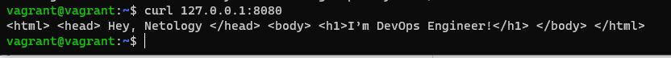
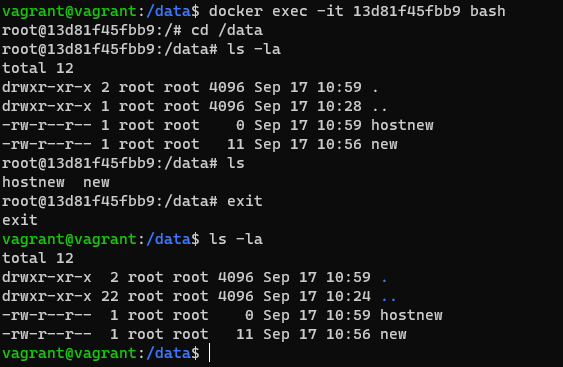
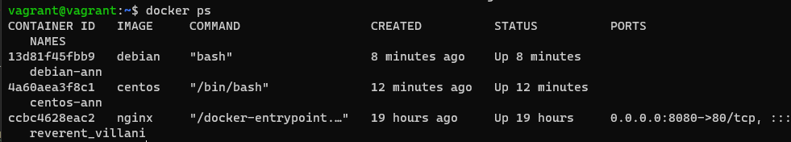

# Домашнее задание к занятию "5.3. Введение. Экосистема. Архитектура. Жизненный цикл Docker контейнера"

## Как сдавать задания

Обязательными к выполнению являются задачи без указания звездочки. Их выполнение необходимо для получения зачета и диплома о профессиональной переподготовке.

Задачи со звездочкой (*) являются дополнительными задачами и/или задачами повышенной сложности. Они не являются обязательными к выполнению, но помогут вам глубже понять тему.

Домашнее задание выполните в файле readme.md в github репозитории. В личном кабинете отправьте на проверку ссылку на .md-файл в вашем репозитории.

Любые вопросы по решению задач задавайте в чате учебной группы.

---


## Важно!

Перед отправкой работы на проверку удаляйте неиспользуемые ресурсы.
Это важно для того, чтоб предупредить неконтролируемый расход средств, полученных в результате использования промокода.

Подробные рекомендации [здесь](https://github.com/netology-code/virt-homeworks/blob/virt-11/r/README.md)

---

## Задача 1

Сценарий выполения задачи:

- создайте свой репозиторий на https://hub.docker.com;
- выберете любой образ, который содержит веб-сервер Nginx;
- создайте свой fork образа;
- реализуйте функциональность:
запуск веб-сервера в фоне с индекс-страницей, содержащей HTML-код ниже:
```
<html>
<head>
Hey, Netology
</head>
<body>
<h1>I’m DevOps Engineer!</h1>
</body>
</html>
```

Опубликуйте созданный форк в своем репозитории и предоставьте ответ в виде ссылки на https://hub.docker.com/username_repo.
https://hub.docker.com/layers/apriemysheva/virt-homeworks/nginx/images/sha256-e5e649671b07cc9f0321a9582aae5b773997fafc9ba149d7fb48dcd847cd0187?context=repo
## Задача 2

Посмотрите на сценарий ниже и ответьте на вопрос:
"Подходит ли в этом сценарии использование Docker контейнеров или лучше подойдет виртуальная машина, физическая машина? Может быть возможны разные варианты?"

Детально опишите и обоснуйте свой выбор.

--

Сценарий:
* Высоконагруженное монолитное java веб-приложение; 

Не подходит, состоит из нескольих процессов требуется проработка связей, недостаток быстродействия. Лучше подойдет физическая машина для максимального быстродействия.
* Nodejs веб-приложение;

Подойдет Docker. Подходит простота развертывания приложения, лёгковесность и масштабирование.
* Мобильное приложение c версиями для Android и iOS; 
 
Не походит, docker не является здесь целевым решением. Предположительно использование виртуальных машин.
* Шина данных на базе Apache Kafka; 
 
Не походит.Лучше использовать физические и виртуальные сервера - в основном связано с тем что при переконфигурировании шины велика вероятность потери отправленных данных.
* Elasticsearch кластер для реализации логирования продуктивного веб-приложения - три ноды elasticsearch, два logstash и две ноды kibana; 
 
Не подходит. При организации логгирования с использованием elk-стека есть несколько вопросов ответы на который позволяют определить что будет использовано: 1. Объём логов 2. Период хранения 3. скорость поиска - в случае высоконагруженных систем с большими объёмами и сроками хранения логов целесообразно использовать физические/виртуальные сервера, т.к. стек elk обычно хорошо утилизирует сервера.
* Мониторинг-стек на базе Prometheus и Grafana; 
 
Подходит. Преймущества - масштабируемость, лёгкость и скорость развёртывания.
* MongoDB, как основное хранилище данных для java-приложения;
 
Не подходит, лучше использовать физическим или виртуальным серверам, ввиду сложности администрирования MongoDB внутри контейнера и вероятности потери данных при потере контейнера.
* Gitlab сервер для реализации CI/CD процессов и приватный (закрытый) Docker Registry.

Docker не подходит в данном случае, т.к. при потере контейнера будет сложно восстановить частоизменяемые данные. Здесь больше подходят физические или виртуальные сервера.


## Задача 3

- Запустите первый контейнер из образа ***centos*** c любым тэгом в фоновом режиме, подключив папку ```/data``` из текущей рабочей директории на хостовой машине в ```/data``` контейнера;
- Запустите второй контейнер из образа ***debian*** в фоновом режиме, подключив папку ```/data``` из текущей рабочей директории на хостовой машине в ```/data``` контейнера;
- Подключитесь к первому контейнеру с помощью ```docker exec``` и создайте текстовый файл любого содержания в ```/data```;
- Добавьте еще один файл в папку ```/data``` на хостовой машине;
- Подключитесь во второй контейнер и отобразите листинг и содержание файлов в ```/data``` контейнера.

!
