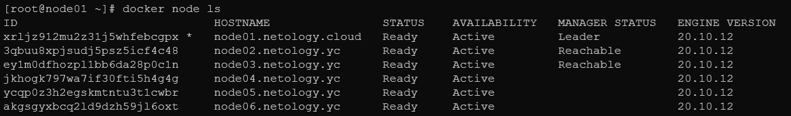
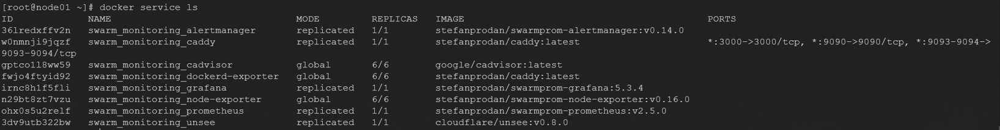

# Домашнее задание к занятию "5.5. Оркестрация кластером Docker контейнеров на примере Docker Swarm"

## Как сдавать задания

Обязательными к выполнению являются задачи без указания звездочки. Их выполнение необходимо для получения зачета и диплома о профессиональной переподготовке.

Задачи со звездочкой (*) являются дополнительными задачами и/или задачами повышенной сложности. Они не являются обязательными к выполнению, но помогут вам глубже понять тему.

Домашнее задание выполните в файле readme.md в github репозитории. В личном кабинете отправьте на проверку ссылку на .md-файл в вашем репозитории.

Любые вопросы по решению задач задавайте в чате учебной группы.

---


## Важно!

Перед отправкой работы на проверку удаляйте неиспользуемые ресурсы.
Это важно для того, чтоб предупредить неконтролируемый расход средств, полученных в результате использования промокода.

Подробные рекомендации [здесь](https://github.com/netology-code/virt-homeworks/blob/virt-11/r/README.md)

---

## Задача 1

Дайте письменые ответы на следующие вопросы:

- В чём отличие режимов работы сервисов в Docker Swarm кластере: replication и global?

```html
Replicated services - можно указать количество выполненных задач.
Global services - можно запустить одну и ту же задачу на каждом узле. Нет необходимости указывать количество заданий заранее
```
- Какой алгоритм выбора лидера используется в Docker Swarm кластере?

```html
Используется алгоритм поддержания распределенного консенсуса RAft. Отказоустойчивость сервиса достигается 
в том числе засчет того, что в кластере могут работать несколько управляющих нод, которые могут в любой момент заменить вышедшео из строя лидера. 
```
- Что такое Overlay Network?
```html
Драйвер оверлейной сети создает распределенную сеть между несколькими узлами демона Docker. Эта сеть находится поверх (перекрывает) сети,
специфичные для хоста, позволяя контейнерам, подключенным к ней (включая контейнеры службы swarm), безопасно обмениваться данными при включенном шифровании.
```
## Задача 2

Создать ваш первый Docker Swarm кластер в Яндекс.Облаке

Для получения зачета, вам необходимо предоставить скриншот из терминала (консоли), с выводом команды:
```
docker node ls
```





## Задача 3

Создать ваш первый, готовый к боевой эксплуатации кластер мониторинга, состоящий из стека микросервисов.

Для получения зачета, вам необходимо предоставить скриншот из терминала (консоли), с выводом команды:
```
docker service ls
```



