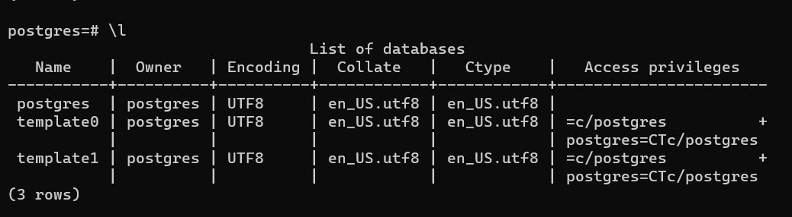
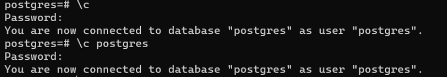
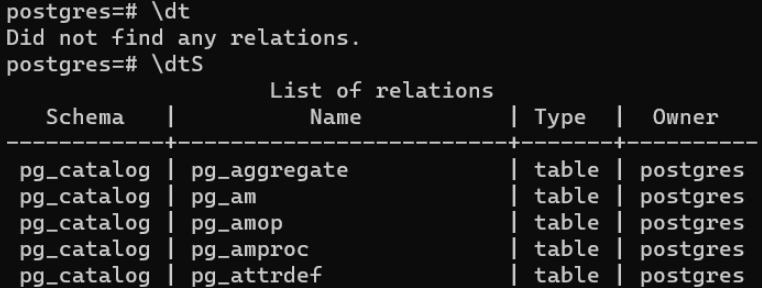
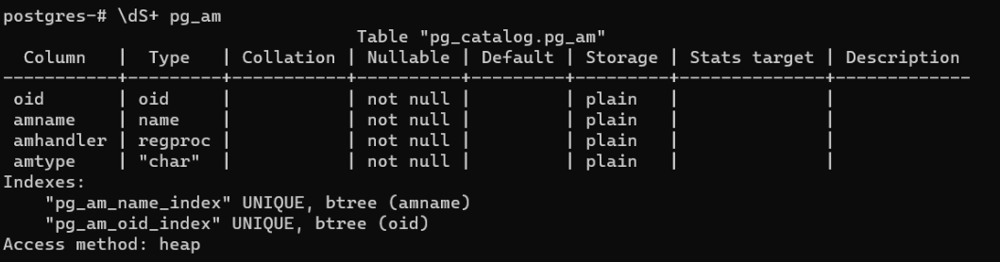
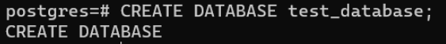
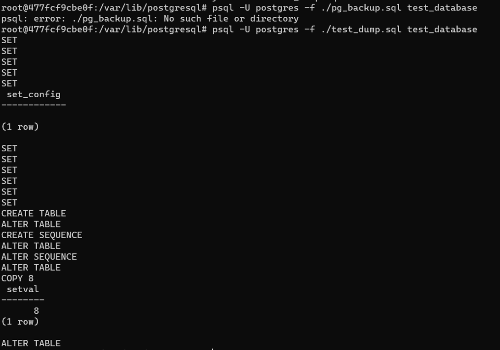
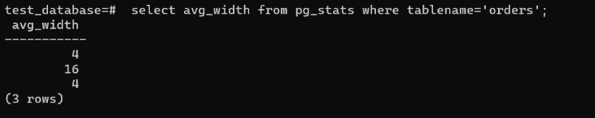
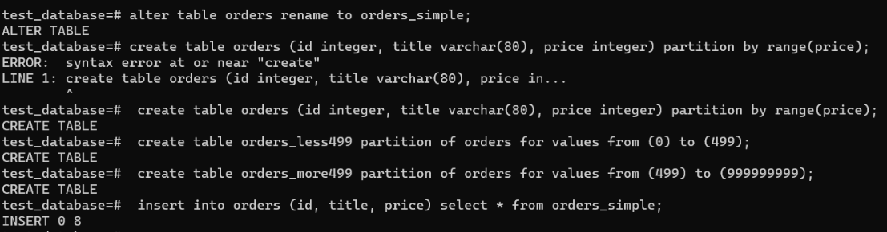

# Домашнее задание к занятию "6.4. PostgreSQL"

## Задача 1

Используя docker поднимите инстанс PostgreSQL (версию 13). Данные БД сохраните в volume.

Подключитесь к БД PostgreSQL используя `psql`.

Воспользуйтесь командой `\?` для вывода подсказки по имеющимся в `psql` управляющим командам.

**Найдите и приведите** управляющие команды для:
- вывода списка БД

- подключения к БД

- вывода списка таблиц

- вывода описания содержимого таблиц

- выхода из psql
postgres=# \q
## Задача 2

Используя `psql` создайте БД `test_database`.


Изучите [бэкап БД](https://github.com/netology-code/virt-homeworks/tree/master/06-db-04-postgresql/test_data).

Восстановите бэкап БД в `test_database`.

Перейдите в управляющую консоль `psql` внутри контейнера.

Подключитесь к восстановленной БД и проведите операцию ANALYZE для сбора статистики по таблице.

Используя таблицу [pg_stats](https://postgrespro.ru/docs/postgresql/12/view-pg-stats), найдите столбец таблицы `orders` 
с наибольшим средним значением размера элементов в байтах.


**Приведите в ответе** команду, которую вы использовали для вычисления и полученный результат.

## Задача 3

Архитектор и администратор БД выяснили, что ваша таблица orders разрослась до невиданных размеров и
поиск по ней занимает долгое время. Вам, как успешному выпускнику курсов DevOps в нетологии предложили
провести разбиение таблицы на 2 (шардировать на orders_1 - price>499 и orders_2 - price<=499).

Предложите SQL-транзакцию для проведения данной операции.

Можно ли было изначально исключить "ручное" разбиение при проектировании таблицы orders?
```html
Можно было бы, если бы при проектировании таблицу сделали бы селекционной. 
```
## Задача 4

Используя утилиту `pg_dump` создайте бекап БД `test_database`.
```html
root@477fcf9cbe0f:/var/lib/postgresql#  pg_dump -U postgres -d test_database >test_database_dump.sql
```
Как бы вы доработали бэкап-файл, чтобы добавить уникальность значения столбца `title` для таблиц `test_database`?
```html
во всех секциях, где создаётся таблица, добавить к title параметр UNIQUE, 
title character varying(80) NOT NULL UNIQUE
alter table orders add unique (title, price);
```
---

### Как cдавать задание

Выполненное домашнее задание пришлите ссылкой на .md-файл в вашем репозитории.

---
